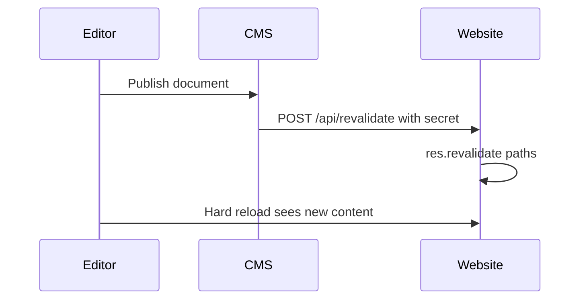

# B-Side website and CMS roadmap

Canonical copy also lives in [bside-ms/bside_website/ROADMAP.md](https://github.com/bside-ms/bside_website/blob/main/ROADMAP.md). Keep the two files in sync when you check off work.

Work for [bside-ms/bside_website](https://github.com/bside-ms/bside_website) and [bside-ms/bside_payload](https://github.com/bside-ms/bside_payload). Implement in small PRs, not as one change. Check a box when the PR is merged and live.

Architecture context: [AGENTS.md](./AGENTS.md) here and [AGENTS.md](https://github.com/bside-ms/bside_website/blob/main/AGENTS.md) on the website.

## Goals

- Editors: publish in Payload means the live page is correct within seconds.
- Devs: sibling clones, copy `.env.skel`, start Mongo + CMS + website, preview and revalidate locally.
- Later: safer deps, Mongo, and deploy pins. Do not mix those with the editor fixes.



---

## Phase A. Publish becomes live

Do this first. Website PR can merge before the CMS PR. Deploy website, then CMS.

### A1. Website revalidation API

Live on `b-side.ms`. `POST /api/revalidate` without key → `401`. With `x-revalidation-key` → `200`, core DE/EN paths `revalidated: true`.

In [bside_website](https://github.com/bside-ms/bside_website):

- [x] Add `pages/api/revalidate.ts` using Pages Router `res.revalidate`.
- [x] Auth: header `x-revalidation-key` must match `REVALIDATION_KEY`.
- [x] Add that env name to `types/environment.d.ts`.
- [x] Core path list for `de` and `en`. Dynamic slugs stay on 60s ISR until A2.
- [x] Keep existing `revalidate: 60` on pages.
- [x] Runtime only: `REVALIDATION_KEY` in server `website.env`. Not a Docker build-arg.

### A2. CMS calls the website after publish

Implemented on `a2-revalidate-after-publish` (CMS + website). Check the boxes when both PRs are merged and live.

- [ ] Add `src/utilities/revalidateWebsite.ts`: `POST ${NEXT_PUBLIC_SITE_URL}/api/revalidate` with header `x-revalidation-key` = `REVALIDATION_KEY` and body `{ paths?: string[] }`.
- [ ] Log failures. Never fail the Payload save if the website is down.
- [ ] Skip draft-only saves. Run when `doc._status === 'published'` or the previous doc was published (unpublish / delete).
- [ ] Globals have no drafts: revalidate on every update.
- [ ] `afterChange` / `afterDelete` on `pages`, `events`, `news`, `circles`, `organisations`, `redirects`.
- [ ] Same on globals `start-page`, `about-bside`, `event-page`, `event-archive`, `banner`.
- [ ] Send extra paths when known (page breadcrumb, event/news slug, circle kebab name, org landings). Website always includes the core set and expands `/en`.
- [ ] Website: accept extra `paths` from the body and revalidate them in addition to the core set.

### A3. Server after A1 + A2

- [ ] Confirm CMS `.env` has a real `REVALIDATION_KEY`.
- [ ] Set the same value on `website.env` as `REVALIDATION_KEY`.
- [ ] Deploy website, then CMS: `docker compose up -d --pull always` / `... payload`.
- [ ] Test: publish a page, hard-reload within a few seconds.
- [ ] If a page is still stuck from before this work: restart the website container (ISR cache in `./cache`).

---

## Phase B. Preview and redirects

### B1. Event live-preview slugs

- [ ] `src/utilities/createEventSlug.ts` must match the website: `{id.slice(-4)}-{kebabCase(slug || title)}`.
- [ ] Keep website `createEventSlugOld` so old URLs still resolve.
- [ ] Fix missing `/` in live-preview URLs for Banner and AboutBside (`SITE_URL` + `bside` today).

### B2. CMS redirects at request time

Today the website fetches redirects at **image build**.

- [ ] Website `middleware.ts`: look up `/api/redirects`, short in-memory cache (~60s), apply `from` → `to`.
- [ ] Keep static `/bio` and the IE redirect in website `next.config.js`.
- [ ] Stop merging CMS redirects into website `next.config.js`.
- [ ] Leave Traefik hostname redirects on the server as they are.
- [ ] After this, website `next build` must not need a running CMS for redirects.

### B3. CMS admin copy (German)

- [ ] Page `bside`: intro and four tiles come from global **Über die B-Side**; body blocks are this page.
- [ ] Locale hint: DE and EN layouts are separate. Publish the language you edited.
- [ ] Distinguish **Live-Seite** vs **Vorschau**.
- [ ] Redirects collection: replace “needs frontend restart” with “live within a minute” after B2.

---

## Phase C. Local DX

Assume a sibling checkout (`bside_website` next to `bside_payload`). No personal machine paths.

### C1. Env skeletons

- [ ] Website: `NEXT_PUBLIC_PAYLOAD_URL=${PAYLOAD_URL}`, `PAYLOAD_API_COLLECTION=api-users`, matching `EXAMPLE_REVALIDATION_KEY`, comment unused `PREVIEW_TOKEN`.
- [ ] This repo: `REVALIDATION_KEY=EXAMPLE_REVALIDATION_KEY` in `.env.skel`.

### C2. Boot docs and types sync

- [ ] Document in both `AGENTS.md` + README: `docker compose up -d` then `yarn dev` on 3000; website `npm run dev` on 3001.
- [ ] Document that admin login needs Keycloak (`CLIENT_SECRET`). Empty secret means no admin UI.
- [ ] Document that `/kultur`, `/quartier`, `/bside/kollektiv` 404 on an empty local DB.
- [ ] Add `yarn sync:types`: `generate:types`, copy to `../bside_website/types/payload/payload-types.ts` if that path exists, otherwise print the GitHub target.

### C3. Small CI hygiene

- [ ] Both workflows: `actions/checkout@v4`.
- [ ] Website CI: add `npm run tsc`.
- [ ] Optional: rename `docker-image.yml`. Image builds move to Actions under G0.

### C4. Independent OrbStack compose (no Node on the host)

Not the production Dockerfiles. Each repo keeps its own compose. Start the stacks separately. No shared project, no sibling build context.

- [ ] This repo: `docker-compose.dev.yml` with Mongo (already in `docker-compose.yml`) plus Payload as `yarn dev` in `node:20`, port 3000, source bind-mounted, `node_modules` in a named volume.
- [ ] Website repo: its own `docker-compose.dev.yml` with `npm run dev` in `node:20`, port 3001, same volume pattern. `PAYLOAD_URL=http://host.docker.internal:3000`.
- [ ] Website may start alone. Pages 404 if the CMS stack is down.
- [ ] Do not use the production image (Chrome, amd64, `next start`) for daily coding.

---

## Phase D. Docs

Do this after A and B so the text matches how publish actually works.

### D1. Agent docs

- [ ] Update both `AGENTS.md` files: revalidation flow, secrets, runtime redirects, event slug format, local boot.

### D2. Editor handbook in the CMS

A page **inside the admin**, German, linked from the nav. Not Confluence, not a public website page.

- [ ] How the loop works: Speichern vs Veröffentlichen, Vorschau vs Live-Seite, a few seconds after publish, hard-reload.
- [ ] Locales: DE and EN are separate. Publish the language you edited.
- [ ] What lives where: Page `bside` vs global **Über die B-Side**, organisations vs circles vs events vs news, redirects, banner (`bannerId`).
- [ ] Block catalog: every block slug editors can add, what it does, when to use it, image size hints (event 1080², circle 1280x720, etc.).
- [ ] Tips: drafts, slugs / last-4 event URLs, circle names become kebab URLs, do not delete the three organisation docs, redirects are live without a website rebuild (after B2).
- [ ] Keep B3 field-level hints. The handbook is the long version.

---

## Phase E. Later: libraries

Own PRs, after editors trust publish again. Never mix with A–D.

### E1. Payload patch on current Next 15

- [ ] Bump `payload` and all `@payloadcms/*` from `3.68.1` to current 3.8x together.
- [ ] Align website `@payloadcms/live-preview-react` with that version.
- [ ] `yarn generate:types`, `yarn generate:importmap`, `yarn sync:types`.
- [ ] Click through admin, Keycloak, draft/publish, media.

Do **not** jump this app to Next 16 just because Payload templates did.

### E2. Website Next 14 (later, large)

- [ ] Stay on Pages Router until there is a real reason to move.
- [ ] A Next 15/16 bump is its own project.

### E3. Housekeeping deps

- [ ] Remove unused `next-auth` from the website if still unused.
- [ ] Drop the stray `yarn` package (`2.0.0-rc.24`) from this `package.json` if unused.
- [ ] Align `eslint-config-next` with installed Next 15.

---

## Phase F. Later: data and content model

### F1. Persist event/news `identifier`

- [ ] Write `identifier` in `beforeChange`, or stop querying it on the website.

### F2. Organisation landings without hardcoded Mongo ids

- [ ] Website should look up by slug or `shortName` instead of the three production ids.
- [ ] Do not delete or recreate Kollektiv / Kultur / GmbH until that ships.

### F3. Mongo 4.4.6 (EOL)

- [ ] Confirm backups of `/srv/docker/b-side.ms/cms/data` and `cms/media`.
- [ ] Staged upgrade. Do not only change the image tag.
- [ ] Test restore before touching production.

---

## Phase G. Later: deploy and security

### G0. Registry on `bsidems`

Hub account: [bsidems](https://hub.docker.com/u/bsidems). Not `leftbit`, not `seebruecke`.

Website and CMS images are **public**. Both GitHub repos are public. The image may only bake `NEXT_PUBLIC_*` (already in the browser). Those build args live in GitHub **variables**, not secrets. Runtime secrets stay in server env files (`website.env`, this repo's `.env` on the server). Do not pass real secrets as Docker build args. `bsidems` has one private-repo slot; keep it for something that must stay private. Public images also mean the server can pull without `docker login`.

- [x] Website: GitHub Actions on `main` pushes `bsidems/bside-website`. First green run: `960dda1`.
- [ ] CMS cutover (do this next). Playbook below.
- [ ] Server compose at `/srv/docker/b-side.ms/cms/` points at `bsidems/bside-cms`. Leave `leftbit/…` only as rollback until the new pull works.

#### CMS cutover playbook

Website is already live on `bsidems`. Do **only** this cutover. Do not start A2, B, E, F, or G6 in the same branch.

**Copy, do not invent.** Mirror [bside_website `.github/workflows/docker-image.yml`](https://github.com/bside-ms/bside_website/blob/main/.github/workflows/docker-image.yml). Differences: this repo uses **Yarn 4**, image name `bsidems/bside-cms`, one build-arg.

**Out of scope**

- A2 revalidate hooks
- Mongo, `data/`, `media/`, `docker compose down`, `down -v`
- Changing Keycloak / `CLIENT_SECRET` / `PAYLOAD_SECRET`
- Adding extra Docker build-args that Hub does not already pass
- `npm`, Payload upgrades, standalone image rewrite

**What the image may bake**

Dockerfile today has one ARG: `NEXT_PUBLIC_CMS_URL`. That is the public CMS origin. It must be `https://cms.b-side.ms` on `main`. Wrong value breaks Keycloak callbacks and the admin client bundle. Runtime-only `.env` will not fix a wrong bake.

Do **not** bake `PAYLOAD_SECRET`, `MONGODB_URI`, `CLIENT_SECRET`, `REVALIDATION_KEY`, `NEXT_PUBLIC_SITE_URL`, `NEXT_PUBLIC_OAUTH_SERVER`. Those stay in `/srv/docker/b-side.ms/cms/.env` like today. Hub only ever passed the CMS URL.

GitHub variable name: `CMS_URL` (no `NEXT_PUBLIC_` prefix). Dockerfile maps it:

```
ARG CMS_URL
ENV NEXT_PUBLIC_CMS_URL=${CMS_URL}
```

Apply that in **both** stages that currently declare `ARG NEXT_PUBLIC_CMS_URL` (`base` and `runtime`). Workflow passes `--build-arg CMS_URL=${{ vars.CMS_URL }}`.

Confirm the live value before setting the variable:

```bash
cd /srv/docker/b-side.ms/cms
docker compose exec payload printenv NEXT_PUBLIC_CMS_URL
```

Expect `https://cms.b-side.ms`. If it differs, use the container value, do not guess.

**Human steps (operator, before or with the PR)**

1. Docker Hub, logged in as `bsidems`: [create repository](https://hub.docker.com/repository/create). Namespace `bsidems`, name `bside-cms` (not `bsidems/bside-cms`). Visibility **public**. No automated builds, no GitHub link.
2. Reuse the existing `bsidems` personal access token (Read & Write) already used as `DOCKERHUB_TOKEN` on `bside_website`. Add the **same** token as repository secret `DOCKERHUB_TOKEN` on `bside-ms/bside_payload`. Do not put it in git.
3. Repository **variable** (Variables tab, not Secrets): `CMS_URL` = `https://cms.b-side.ms`.
4. Merge to `main` only when 2 and 3 are set, or the first build job fails closed.

**Code (this repo)**

1. Extend `.github/workflows/docker-image.yml`:
   - Keep the lint job (`yarn install`, `yarn lint`, `yarn ts-check`, `yarn prettier`). Bump `actions/checkout` to `@v4` (today `@v2`).
   - Keep the install flag that already works on Actions. Today that is `yarn install --frozen-lockfile`. Do not switch the package manager.
   - Add a `build` job: `needs: lint`, `if: github.ref == 'refs/heads/main'`, `timeout-minutes: 60`.
   - Fail the job if `secrets.DOCKERHUB_TOKEN` or `vars.CMS_URL` is empty.
   - `docker/setup-buildx-action@v3`, `docker/login-action@v3` username `bsidems`, password `secrets.DOCKERHUB_TOKEN`.
   - `docker/build-push-action@v6`: `platforms: linux/amd64`, `push: true`, tags `bsidems/bside-cms:latest` and `bsidems/bside-cms:${{ github.sha }}`, build-arg `CMS_URL=${{ vars.CMS_URL }}`, `cache-from` / `cache-to` `type=gha` `mode=max`.
2. Dockerfile: rename the ARG as above. Leave Alpine, Yarn 4, `yarn build`, copy `.next` + `node_modules`, `yarn start -p 3000`. Media stays out of the image.
3. `hooks/build`: comment that it is leftover. Hub autobuilds are unused after cutover. Do not delete in this PR.
4. Update `AGENTS.md` Deploy: Actions on `main` builds and pushes `bsidems/bside-cms`. Server pulls that image. `hooks/build` is leftover.
5. Check this G0 box when the image is live, not when the PR opens.

**Server (after Actions is green)**

Path: `/srv/docker/b-side.ms/cms/`

```bash
# compose: image: bsidems/bside-cms:latest  (was leftbit/bside-cms:latest)
# only the payload service
docker compose up -d --pull always payload
```

Never `docker compose down`. Never `down -v`. Mongo stays up. Volumes `data/` and `media/` stay mounted. `PAYLOAD_CONFIG_PATH` in compose is a Payload v2 leftover; do not "fix" it in this PR.

Public image: no `docker login` on the server.

**Test**

- `https://cms.b-side.ms` loads.
- Keycloak login still works (wrong baked `CMS_URL` is the usual break).
- Published REST still answers (`/api/pages` or `/api/news`).
- Website `https://b-side.ms` still renders. Do not redeploy the website in this step.
- `docker compose images` / `docker inspect` shows `bsidems/bside-cms`, not `leftbit`.

**Done when**

- [ ] Hub repo `bsidems/bside-cms` exists and is public.
- [ ] `DOCKERHUB_TOKEN` + `CMS_URL` set on this GitHub repo.
- [ ] Workflow on `main` pushed `bsidems/bside-cms:latest` and `:<sha>`.
- [ ] Server `payload` service runs that image. Mongo untouched.
- [ ] Admin login and public API work.
- [ ] This G0 CMS box and the server-compose box above are checked.

### G1. Pin images

- [ ] Run `bsidems/bside-cms:<gitsha>` and `bsidems/bside-website:<gitsha>` on the server.
- [ ] Keep `:latest` as an alias only.

### G2. Server compose cleanup

- [ ] Remove unused `PAYLOAD_CONFIG_PATH` (Payload v2 leftover).
- [ ] Never `docker compose down -v`.

### G3. Dead env and leftover staging

- [ ] Clean unused keys after the code no longer mentions them.
- [ ] Ignore dead `dev` / `*_DEV` / `latest-test` Docker Hub paths.

### G4. Abuse surface

- [ ] Rate-limit or shared-secret on public `create` for `contact-forms` and `not-found-pages`.
- [ ] Revisit `cors: '*'`.

### G5. Optional later

- [ ] Shared types package only if `yarn sync:types` is still painful.
- [ ] CMS image build in GitHub Actions (website already moved; see G0).
- [ ] Watchtower on `:latest`: do not do this.
- [ ] Local password login: out of scope unless admin-onboarding is a real block.

### G6. Website image, CI, and content hygiene

Canonical detail lives in the [website ROADMAP G6](https://github.com/bside-ms/bside_website/blob/main/ROADMAP.md). First Actions image build took ~8 min; most of that is SSG of 1144 pages against this CMS. Do not mix these with A–F.

**CMS-side (this repo / editor content)**

- [ ] Clean RichText links that the website build logs as `incorrect link` (`null`, empty text, hosts without `https://`).
- [ ] Fix broken event/page URLs that Next rejects at build: `https//…`, leading spaces, malformed ticket links.
- [ ] `/kreise/hansawerkstatt` ships ~230 kB of page data. Trim or split so the website stays under the 128 kB warning.

**Website-side (other repo, listed so the pair stays in sync)**

- [ ] Stop prerendering every event slug in the website image build.
- [ ] Use Next `standalone` output in the website Dockerfile.
- [ ] Website CI: minimum `permissions`, skip lint-during-`next build`, confirm GHA layer cache, Dockerfile `FROM AS` / `ENV key=value`.
- [ ] Deps later (not now): `npm audit`, React 19 / Next 14 `--force`, browserslist.

---

## Suggested PR order

1. A1 website revalidate API (done, live)
2. **G0 CMS Hub cutover** (done on `main`; playbook above).
3. A2 CMS hooks + website extra paths, then A3 server env
4. B1 preview slugs (can ride with A2)
5. B2 runtime redirects
6. B3 + C + D1
7. D2 editor handbook in the CMS (after A and B are live)
8. E1 Payload bump
9. F and the rest of G when someone has backup time

Each step should be mergeable alone. A without B already helps the `/bside` publish complaint.
